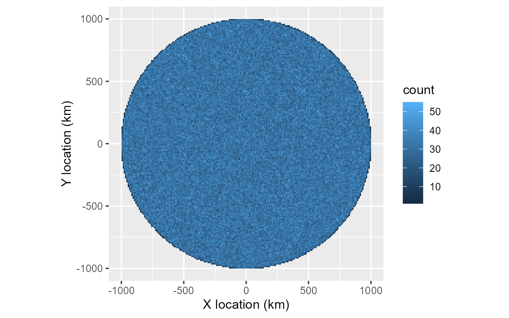
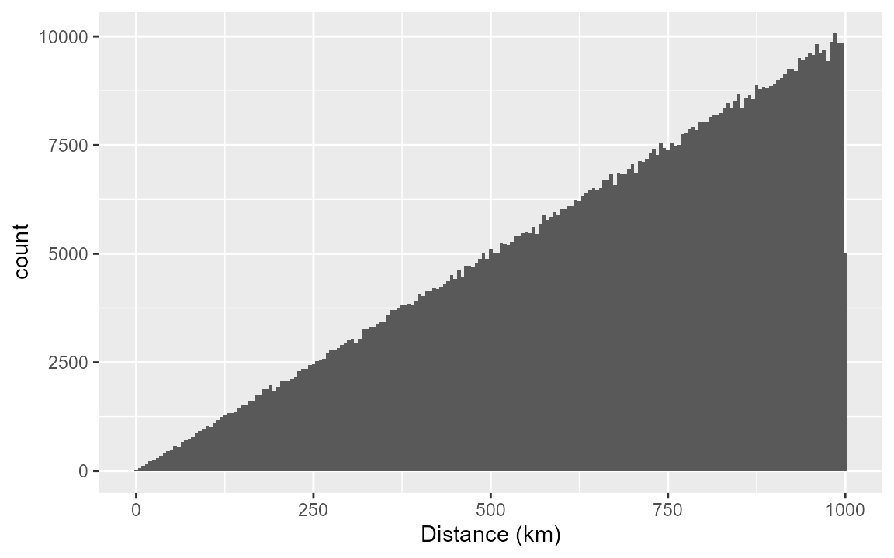
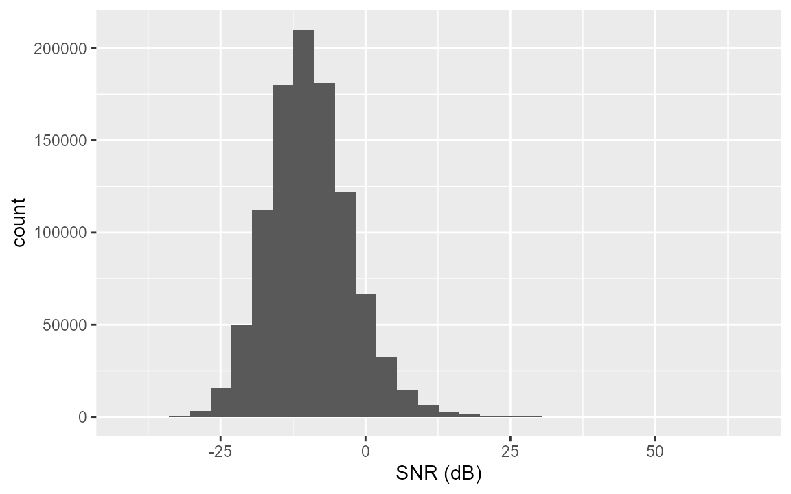
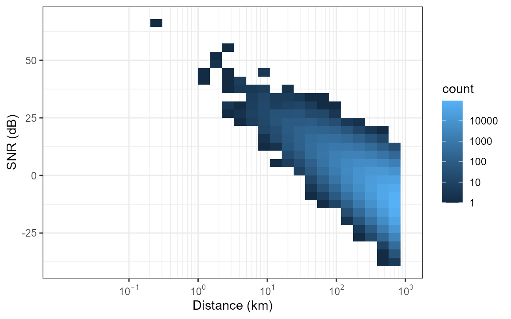
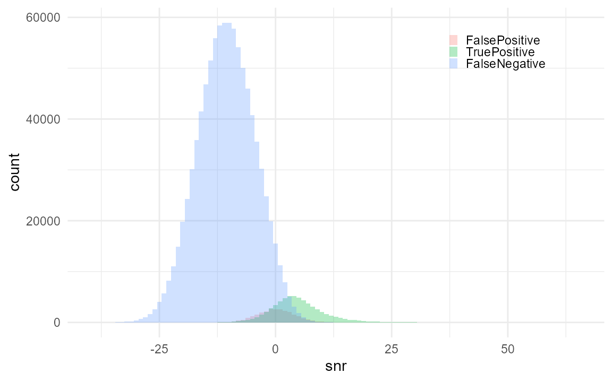
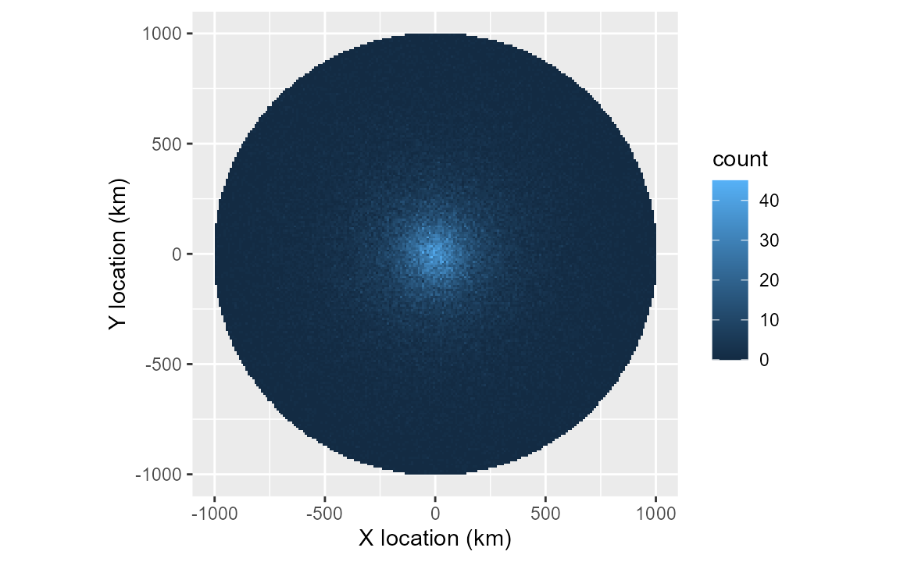

# Call density with a simulated dataset

``` r

library(callDensity)
library(ggplot2)
library(scales)
library(kableExtra)
```

## Simple test of callDensity R package

Create a synthetic dataset with known (specified) values for all
parameters for testing the callDensity R package which implements the
methods described by Castro et al. (2024). This package implements a
solution for call density estimation from single sensors (hydrophones)
via the density equation

``` math
\begin{equation}
D_c = \frac{N_c(1-c)}{kTp_aA}
\end{equation}
```

where: $`D_c`$ is call density, $`N_c`$ is number of calls, $`c`$ is
false discovery rate, $`k`$ is number of sensors (here always 1), $`T`$
is the duration of data analysed (in hours), $`p_a`$ is the probability
of detection in the study area, and $`A`$ is the study area (in km^2).

### 1) Generate known call distribution in space.

Start with *n* calls within radius *R* of the hydrophone. This should
produce a known call density with a uniform random distribution in a
circle around the hydrophone.

``` r


n = 1e6; # number of simulated calls (regardless of whether detected or not); 
R = 1e6; # radius in m (i.e. 1e6=1000km)
k <- 1   # number of sensors (always 1 for single hydrophone moorings)
minDate <- as.POSIXct("2025-01-01")
maxDate <- as.POSIXct("2026-01-01")
Time <- as.numeric(difftime(maxDate,minDate,unit="days"))/365 # in years

# Call density, D_c is n/A 
A = studyArea(R/1e3) # Circular study area in km^2
TrueCallDensity = n/(A*Time) # calls/km^2/time

# 1) Generate n uniformly distributed calls within radius R and time period Time
sim <- simCallLocation(n=n, R=R, minDate=minDate, maxDate=maxDate)

# 'Spatial' map showing true location of all calls
ggplot(data=sim, aes(x=x/1e3,y=y/1e3))+
  geom_bin_2d(alpha=1,binwidth=c(10,10))+
  coord_equal()+
  xlab("X location (km)")+
  ylab("Y location (km)")
```



### 2) Calculate distances of calls.

Assume recorder is located at centre of study area.

Distances are the magnitude of the x & y location (and stored in column
named ‘d’).

Uniform density and increasing area with larger distances should yield a
triangular distance distribution.

``` r


ggplot(data=sim, aes(x=d/1e3))+
  geom_histogram(binwidth = 5)+
  xlab("Distance (km)")
```



### 3) Assign sonar equation parameters to each call (SL,NL,TL)

#### a) Source Level (SL)

Assume source level, SL, is that of Antarctic blue whale song (as in
Castro et al. (2024)).

However, to keep things clearer in this simple example, we use a lower
standard deviation than was used by Castro et al. (2024).

The values we chose match reasonably well with those that have been
estimated for this animal mean of 189 dB and standard deviation of 3-8
dB. Realistic values should help make our simulation better match
reality.

``` r


SL <- data.frame(mean=190, sd=4, sampleSize=350)
```

#### b) Noise Level (NL).

We assign NL to each call using a similarly realistic parameters for the
distribution of NL.

Our NL distribution resembles the same real-world measurements used by
Castro et al. (2024) that were derived from noise samples in the same
band, but adjacent in time to the Antarctic blue whale calls they
detected. Again, this helps ensure our acoustic environment is somewhat
grounded in reality and enhances the plausibility and realism of our
simulation.

``` r


NL = data.frame(mean=84, sd = 4, sampleSize = n)
```

#### c) Transmission Loss (TL)

We assign TL to each call using a simple spherical spreading propagation
model:

``` math
\begin{equation}
TL = 20  log_{10}  d
\end{equation}
```

This TL model is a commonly used analytical expression for transmission
loss. Despite it’s simplicity, it remains physically plausible and
interpretable.

``` r


tlFunc <- function(r)20*log10(r)

sim <- simCallAcoustics(sim, SL, NL, TL = tlFunc)
```

### 6) Calculate SNR for each call

The function simCallAcoustics calculates SNR (in dB) for simulated calls
via the passive sonar equation:

``` math
\begin{equation}
SNR = SL-TL-NL
\end{equation}
```

SNR for each call is stored in the simulation data.frame in a column
named ‘snr’.

``` r


# Visualise SNR distribution
ggplot(data=sim, aes(x=snr))+
  geom_histogram()+
  xlab("SNR (dB)")
```



``` r


# SNR as a function of distance
ggplot(data=sim, aes(x=d/1e3, y=snr))+
  # geom_point(alpha=0.1,size=0.1)+
  geom_bin_2d()+
  xlab("Distance (km)")+
  ylab("SNR (dB)")+
  scale_x_log10(limits=c(0.01,1000),
                labels=label_log(),
                breaks=10^(-1:7),
                minor_breaks = rep(1:9,6)*(10^rep(-1:7,each=9)))+
  annotation_logticks(sides='') +
  scale_fill_gradient(name = "count", trans = "log",
                      breaks = c(1,10,1e2,1e3,1e4), labels=c(1,10,1e2,1e3,1e4))+
  theme_bw()
```



### 7) Simulate detection process (including false positives)

To simulate the detection process we need to make some assumptions about
the behaviour of the detector.

Generally, it is assumed the detector has a high probability of
detection at high SNR, and a low(er) probability of detection at low
SNR. In quantitative sonar performance modelling sometimes a
step-function or logistic curve is used when an analytical expression is
required. If ground truth data on the detectors performance are
available, these models can be fit to the detection data.

Assume probability of detection, p_det, for detector 1 follows a
logistic curve with SNR as the only independent variable.

We can assign a location/intercept for this curve (i.e. location along
x-axis where p_det=0.5). We can also assign a scale/slope of the curve
to represent the steepness of the transition between low proability and
high probability.

In addition to the probability of detection, there is also a probability
of false alarm (false positive predictions) that we would like to
simulate as well. There can be multiple mechanisms that can produce
false positives. For example, they could be triggered by intense
high-SNR sound in the same band as the signal, but from a different
source. For some signal types, false positives can also arise from small
deviations in ambient noise (producing false positive detections that
contain very low SNR). Again, if ground truth data are available then
the relationship between false positive detections and false-positive
power to noise ratio (SNR of false positives) can be modeled in a
similar manner to that of probability of detection.

``` r


#Specify parameters for detector 1
det1params = data.frame( 
  location=3,    # AKA intercept?
  scale=2,       # AKA slope?
  func='plogis', # logistic function
  c=0.3,         # False discovery rate (1-precision)
  fpMean = 0,    # mean SNR of false positive distribution (dB)
  fpSD = 4       # Standard deviation of false positive distribution (dB)
)

# Simulate the detection/non-detection of calls and add columns to the
# simulation to indicate which were detected. Also simulated false positives and
# add these rows to the simulation as well.
sim <- simulateDetector(detParams=det1params, sim)
```

``` r


# Nc total number of detected calls, including both true and false positive
Nc <- sum(sim$detect_table)

# We've generated the right number of false positive detections now and merged
# these into our simulation. 
# But the false positives are missing locations, distances, SL, and p_dets. Not
# sure that this actually matters though.

# SNR Distribution

plotDetectionDistribution(sim)
```



``` r


sim <- sim[order(sim$datetime),]
```

Compare against the true spatial distribution shown in section 1:
[`plotSpatialDetections()`](https://briansmiller.github.io/callDensity/reference/plotSpatialDetections.md)
shows the same map, weighted by what was actually detected rather than
every simulated call. The gap between the two is the spatial signature
of the detection process itself.

``` r


plotSpatialDetections(sim)
```



### 8) Subsample data for detector characterisation

Format results so that they can be used by the callDensity package for
testing.

``` r


n_subsample <- 1e4

subsample <- sim[sample(nrow(sim), n_subsample),]
```

[`chtToSNRinfo()`](https://briansmiller.github.io/callDensity/reference/chtToSNRinfo.md)
builds the SNRinfo table
[`cde()`](https://briansmiller.github.io/callDensity/reference/cde.md)
needs downstream, filtering to real calls before fitting a detection
function – unlike a plain column rename, this drops false-positive rows
(which are detections by construction, so including them would bias the
fitted curve toward “always detected”).

``` r


subsample$CallRL <- subsample$SL - subsample$TL

SNRinfo <- chtToSNRinfo(subsample, groundTruth = "groundTruth", observers = "detect_table",
                        signalCol = "CallRL", noiseCol = "noiseRMSdB", timeCol = "datetime")

# Estimate NL from detections
NLsamp <- SNRinfo %>% dplyr::summarise(mean=mean(NoiseRL,na.rm = TRUE),
                             sd=sd(NoiseRL,na.rm = TRUE),
                             sampleSize=dplyr::n()-sum(is.na(NoiseRL)))
truncationDistances <- R 

# Estimate TL for four radial transects to use for estimating p_det
TL <- simTLradials_20logR(maxRange=R, rangeStep=100, numTransects=4)
```

### 9) Calculate call densities using callDensity package

#### a) GLM fit to SNR detection function

The detector was a logistic function, so fitting a GLM should provide
good results.

``` r


snrDetFun.glm <- callDensity::fitDetFun(SNRinfo, modelType = "glm")
```

[`showDetFun()`](https://briansmiller.github.io/callDensity/reference/showDetFun.md)
plots the fitted curve against the observed SNR distribution of detected
and missed calls – worth looking at before jumping straight to a density
estimate, since it’s the thing everything downstream depends on.

``` r


showDetFun(snrDetFun.glm, SNRinfo=SNRinfo, distribution = "density")
```


[`cde()`](https://briansmiller.github.io/callDensity/reference/cde.md)
does the rest in one call: fits together `c` (false discovery rate),
`p_a` (probability of detection in the area, via
[`pDetInArea()`](https://briansmiller.github.io/callDensity/reference/pDetInArea.md)
internally), and `Dc` (call density) – along with each of their
coefficients of variation, not just a point estimate.
`returnDetFun`/`returnPdetDetail` are opt-in extras: the fitted curve
and
[`pDetInArea()`](https://briansmiller.github.io/callDensity/reference/pDetInArea.md)’s
full per-transect detail, attached as attributes rather than changing
what
[`cde()`](https://briansmiller.github.io/callDensity/reference/cde.md)
normally returns.

``` r


# outerloop is the same across all three model types below (glm/gam/scam) --
# a fair model comparison needs the same Monte Carlo precision for each, or
# any difference in CV.Dc could just be an artefact of iteration count
# rather than a genuine effect of model choice.
results.glm <- cde(Nc=Nc, capHistTab = subsample, snrDetFun = snrDetFun.glm,
                   SL = SL, TL = TL, NL = NLsamp, k = k, T = Time, A = A,
                   modelType = 'glm', truncationDistance = R, outerloop = 10,
                   groundTruthCol = "groundTruth", observerCol = "detect_table",
                   snrColName = "snr", timeCol = "datetime",
                   returnDetFun = TRUE, returnPdetDetail = TRUE)

results.glm[, c("Dc","Nc","c","pa","CV.Dc","CV.pa","CV.c")]
#>          Dc    Nc         c        pa      CV.Dc      CV.pa       CV.c
#> 1 0.3344849 87368 0.3106796 0.0573122 0.07499507 0.05411405 0.05192234
```

#### b) GAM fit to SNR detection function

A GAM should also be able to provide a good fit to a logistic function.
Same pattern as above, just swapping `modelType`.

``` r


snrDetFun.gam <- callDensity::fitDetFun(SNRinfo, modelType = "gam", numKnots = 3)

results.gam <- cde(Nc=Nc, capHistTab = subsample, snrDetFun = snrDetFun.gam,
                   SL = SL, TL = TL, NL = NLsamp, k = k, T = Time, A = A,
                   modelType = 'gam', truncationDistance = R, outerloop = 10,
                   groundTruthCol = "groundTruth", observerCol = "detect_table",
                   snrColName = "snr", timeCol = "datetime",
                   returnDetFun = TRUE, returnPdetDetail = TRUE)

results.gam[, c("Dc","Nc","c","pa","CV.Dc","CV.pa","CV.c")]
#>          Dc    Nc         c         pa      CV.Dc      CV.pa       CV.c
#> 1 0.3251656 87368 0.3106796 0.05895478 0.07582335 0.05525623 0.05192234
```

#### c) SCAM fit to SNR detection function

Shape constrained additive models (SCAMs) should also provide a good fit
to a logistic function. Same pattern again.

``` r


snrDetFun.scam <- callDensity::fitDetFun(SNRinfo, modelType = "scam", numKnots = 5)

results.scam <- cde(Nc=Nc, capHistTab = subsample, snrDetFun = snrDetFun.scam,
                   SL = SL, TL = TL, NL = NLsamp, k = k, T = Time, A = A,
                   modelType = 'scam', truncationDistance = R, outerloop = 10,
                   groundTruthCol = "groundTruth", observerCol = "detect_table",
                   snrColName = "snr", timeCol = "datetime",
                   returnDetFun = TRUE, returnPdetDetail = TRUE)

results.scam[, c("Dc","Nc","c","pa","CV.Dc","CV.pa","CV.c")]
#>          Dc    Nc         c         pa     CV.Dc      CV.pa       CV.c
#> 1 0.3263659 87368 0.3106796 0.05873796 0.1008904 0.08650399 0.05192234
```

#### Comparing the three curves

[`showDetFun()`](https://briansmiller.github.io/callDensity/reference/showDetFun.md)
also compares multiple fitted models directly, given as a named list.
For a detector this well-behaved – a clean logistic response, no unusual
SNR-dependent quirks – the three curves should sit almost on top of each
other, and so should their `Dc` estimates and `CV.Dc` above: model
choice matters little here. That’s the point of showing all three, not
that they diverge. (`snrThreshold.Rmd` walks through a case where the
model choice, and more specifically the *sample* it’s fit on, matters a
great deal.)

``` r


showDetFun(list(glm = snrDetFun.glm, gam = snrDetFun.gam, scam = snrDetFun.scam),
           distribution='density',rug=FALSE)
```


#### Directional detection footprint

[`plotPDetRadials()`](https://briansmiller.github.io/callDensity/reference/plotPDetRadials.md)
shows probability of detection as a function of both range and azimuth
around the recorder – the spatial counterpart to the SNR-based curve
above, and the natural bookend to the true-call and detected-call
spatial maps in sections 1 and 7. This simulation is isotropic
(spherical spreading, identical noise and detector at every azimuth), so
the footprint below should come out close to circular; real,
non-isotropic propagation (bathymetry, directional noise) would show up
here as a genuinely lopsided footprint instead.

``` r


plotPDetRadials(attr(results.scam, "pDetResults"))
```


### Results

Table showing how the the results of each call density estimate compare
to the true values. The only difference between the three estimates is
type of model used to fit the SNR-detection function (glm, gam, scam).

``` r


resultsTrue <- data.frame(season='year', siteCode='', Nc=n, c=det1params$c,
                          k=1, T=Time, A=A, pa=mean(sim$p_det,na.rm=TRUE),
                          SLmean=SL$mean, SLsd=SL$sd, NLmean=NL$mean, NLsd=NL$sd,
                          modelType='true', CV.Nc=0, CV.c=0, CV.pa=0,
                          Dc=TrueCallDensity, CV.Dc=0)

results <- rbind(resultsTrue, results.glm, results.gam, results.scam)

kableExtra::kbl(results[, c('Dc','Nc','A','NLmean','NLsd','modelType','c','pa','CV.Dc')],
                digits = c(4,0,0,1,2,NA,3,4,4),
                col.names= c('Dc','Sample Size','A','NL_mean','NL_sd',
                             'Model','c','P_a','CV.Dc')) %>% 
  kableExtra::kable_classic(full_width=FALSE)
```

|     Dc | Sample Size |       A | NL_mean | NL_sd | Model |     c |    P_a |  CV.Dc |
|-------:|------------:|--------:|--------:|------:|:------|------:|-------:|-------:|
| 0.3183 |     1000000 | 3141593 |      84 |  4.00 | true  | 0.300 | 0.0611 | 0.0000 |
| 0.3345 |       87368 | 3141593 |      84 |  4.03 | glm   | 0.311 | 0.0573 | 0.0750 |
| 0.3252 |       87368 | 3141593 |      84 |  4.03 | gam   | 0.311 | 0.0590 | 0.0758 |
| 0.3264 |       87368 | 3141593 |      84 |  4.03 | scam  | 0.311 | 0.0587 | 0.1009 |

## References

Castro, Franciele R., Danielle V. Harris, Susannah J. Buchan, Naysa
Balcazar, and Brian S. Miller. 2024. “Beyond Counting Calls: Estimating
Detection Probability for Antarctic Blue Whales Reveals Biological
Trends in Seasonal Calling.” *Frontiers in Marine Science* 11 (July).
<https://doi.org/10.3389/fmars.2024.1406678>.
