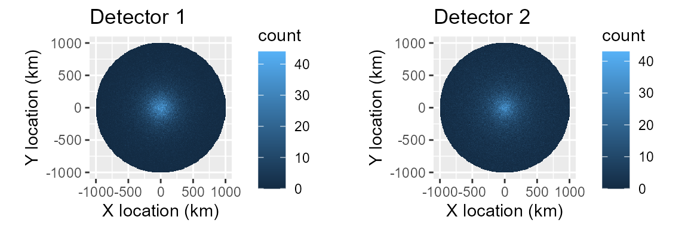
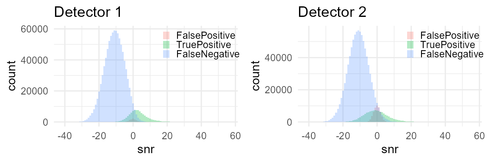
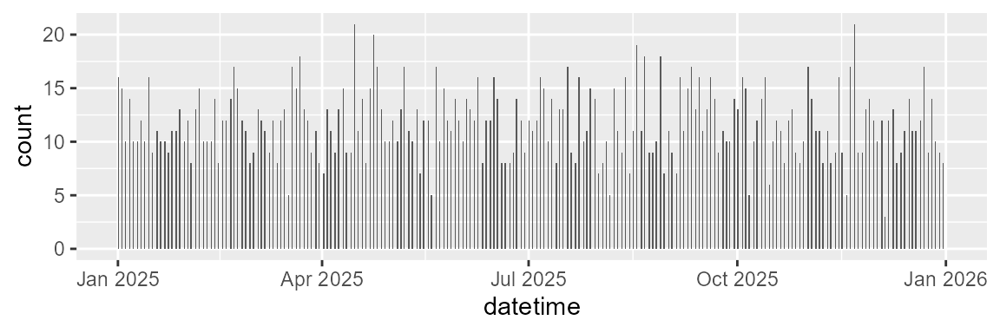
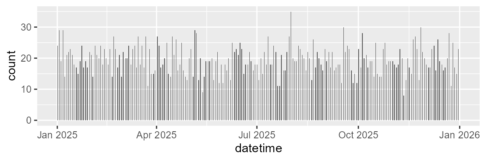

# Imperfect ground truth: capture-recapture (Common Ground) as the fix

``` r

library(callDensity)
library(ggplot2)
library(scales)
library(kableExtra)
```

## Two-detector test of callDensity R package

Building on the foundation provided by the first vignette, here we
attempt to make our simulation even more realistic.

In our first simulation, we simulated a uniform distribution of
Antarctic blue whale calls around a hydrophone in a homogenous
environment with spherical spreading. We also simulated an automated
detector that operated according to a logistic function of SNR. We also
simulated false positive detections for the automated detector as an
independent normal-distribution in SNR.

We then took a subset of all the calls to simulate annotation of a
subset of the data for characterisation of the detectors performance.
Specifically, we used the callDensity package to estimate the
probability of detecting a single call as a function of SNR from the
subset. In our first simulation, we modelled this probabilty of
detection using the known ground-truth from the simulation.

In the work of Castro et al. (2024) an expert human observer provides
the ground truth annotations. However, not every expert human observers
can be “practically perfect in every way,” and some analysts might fall
slightly short of that Mary Poppins level of perfection.

In reality, we cannot expect to obtain perfect ground truth data. A more
realistic expectation is that we will have detections from more than one
observer. Here the term observer includes both algorithms and human
observers.

Our goal in this simulation is to explore and understand how imperfect
estimation of the ground truth affects our ability to estimate call
density.

Again, we start with the density equation:

``` math
\begin{equation}
D_c = \frac{N_c(1-c)}{kTp_aA}
\end{equation}
```

where: $`D_c`$ is call density, $`N_c`$ is number of calls, $`c`$ is
false discovery rate, $`k`$ is number of sensors (here always 1), $`T`$
is the duration of data analysed (in hours), $`p_a`$ is the probability
of detection in the study area, and $`A`$ is the study area (in km^2).

### Generate known call distribution in space and time.

Start with *n* calls within radius *R* of the hydrophone. This should
produce a known call density with a uniform random distribution in a
circle around the hydrophone. Assuming the recorder is located at centre
of study area then distances are the magnitude of the x & y location. A
uniform density and increasing area with larger distances should yield a
triangular distance distribution.

``` r


# 1) Generate a distribution of n calls within radius R of the hydrophone with a
# known call density Uniform random in circle

n = 1e6; # number of simulated calls (regardless of whether detected or not); 
R = 1e6; # radius in m (i.e. 1e6=1000km)
k <- 1   # number of sensors (always 1 for single hydrophone moorings)
minDate <- as.POSIXct("2025-01-01")
maxDate <- as.POSIXct("2026-01-01")
Time <- as.numeric(difftime(maxDate,minDate,unit="days"))/(365) # in years

# Call density, D_c is n/A 
A = studyArea(R/1e3) # Circular study area in km^2
TrueCallDensity = n/(A*Time) # calls/km^2/time

set.seed(1)
# 1) Generate n uniformly distributed calls within radius R and time period Time
sim <- simCallLocation(n=n, R=R, minDate=minDate, maxDate=maxDate)
cat('Study area (km^2): ', A, '\n')
#> Study area (km^2):  3141593
cat('Number of calls: ', n ,'\n');
#> Number of calls:  1e+06
cat('Time units:', Time, '\n')
#> Time units: 1
cat('True call density (calls per km^2 per unit time): ',TrueCallDensity, '\n')
#> True call density (calls per km^2 per unit time):  0.3183099
```

### Assign sonar equation parameters to each call (SL,NL,TL)

#### a) Source Level (SL)

Assume source level, SL, is that of Antarctic blue whale song (as in
Castro et al. (2024)), a mean of 190 dB re 1 uPa.However, to keep things
clearer in this simple example, we use a standard deviation of 4 dB,
which is lower than that used by Castro et al. (2024). These values
match reasonably well with those that have been estimated for this
animal mean of 189 dB and standard deviation of 3-8 dB. Realistic values
should help make our simulation better match reality.

#### b) Noise Level (NL)

We assign NL to each call using a similarly realistic parameters for the
distribution of NL.

Our NL distribution resembles the same real-world measurements used by
Castro et al. (2024) that were derived from noise samples in the same
band, but adjacent in time to the Antarctic blue whale calls they
detected. Again, this helps ensure our acoustic environment is somewhat
grounded in reality and enhances the plausibility and realism of our
simulation.

#### c) Transmission Loss (TL)

We assign TL to each call using a simple spherical spreading propagation
model:

``` math
\begin{equation}
TL = 20  log_{10}  d
\end{equation}
```

This TL model is a commonly used analytical expression for transmission
loss. It is a gross oversimplification compared to real-world
transmission losses. However, it has a sound theoretical basis that is
readily interpretable (i.e. it’s an inverse square law, which is common
in physics).

There has already been some investigations of how uncertainty in TL
affects call density (e.g. Helble et al 2013), and TL variability and
mismatch is not the focus of this vignette, so there’s reasonable
justification for keeping this part simple.

Finally, with our acoustic properties assigned, we apply the passive
sonar equation (in dB):
``` math
\begin{equation}sim
SNR = SL-TL-NL
\end{equation}
```

``` r


SL <- data.frame(mean=190, sd=4, sampleSize=350) # True SL distribution for sim
NL = data.frame(mean=84, sd = 4, sampleSize = n)  # True NL distribution for sim
tlFunc <- function(r)20*log10(r)

# Simulate the true acoustic properties of each call and false positive 
sim <- simCallAcoustics(sim, SL, NL, TL = tlFunc)

# Per-transect estimate of TL (used by callDensity package to estimate pDet)
TL <- simTLradials_20logR(maxRange=R, rangeStep=100, numTransects=4)
```

Here’s the code from the callDensity package used to simulate sonar eq
parameters for calls

`simCallAcoustics<-`

``` r

function (maxRange, rangeStep, numTransects) 
{
    range_m = seq(from = 5, to = maxRange, by = rangeStep)
    tlTransectSpherical <- 20 * log10(range_m)
    tlTransects <- replicate(numTransects, tlTransectSpherical)
    angleStep <- 360/numTransects
    angles = seq(from = 0, to = 360 - angleStep, by = angleStep)
    colnames(tlTransects) <- paste0("tl", angles)
    TL <- data.frame(range_m)
    TL <- cbind(TL, tlTransects)
    return(TL)
}
```

And the code for the fucntion to simulate TL

`simTLradials_20logR <-`

``` r

function (maxRange, rangeStep, numTransects) 
{
    range_m = seq(from = 5, to = maxRange, by = rangeStep)
    tlTransectSpherical <- 20 * log10(range_m)
    tlTransects <- replicate(numTransects, tlTransectSpherical)
    angleStep <- 360/numTransects
    angles = seq(from = 0, to = 360 - angleStep, by = angleStep)
    colnames(tlTransects) <- paste0("tl", angles)
    TL <- data.frame(range_m)
    TL <- cbind(TL, tlTransects)
    return(TL)
}
```

### Simulate detection process

To simulate the detection process we need to make some assumptions about
the behaviour of the detector.

Generally, if not by definition, a detector has a higher probability of
detection at high SNR, and a lower probability of detection at low SNR.
In quantitative sonar performance modelling sometimes a step-function or
logistic curve is used when an analytical expression is required. If
ground truth data on the detectors performance are available, these
models can be fit to the detection data.

Assume probability of detection, p_det, for both detectors follows a
logistic curve with SNR as the only independent variable. We can assign
a location/intercept for this curve (i.e. location along x-axis where
p_det=0.5). We can also assign a scale/slope of the curve to represent
the steepness of the transition between low proability and high
probability.

#### Simulate false positives

In addition to the probability of detection, there is also a probability
of false alarm (false positive predictions) that we would like to
simulate as well.

There can be multiple mechanisms that can produce false positives. For
example, they could be triggered by intense high-SNR sound in the same
band as the signal, but from a different source. For some signal types,
false positives can also arise from small deviations in ambient noise
(producing false positive detections that contain very low SNR). Again,
if ground truth data are available then the relationship between false
positive detections and false-positive power to noise ratio (SNR of
false positives) can be modeled in a similar manner to that of
probability of detection.

Here we assume false positive detections are distributed around some
mean low SNR. This means that false positives in the ‘ground truth’
detector can affect the pDet~SNR curve/function.

#### Parameterise detectors

Summary of detectors:

| Detector | Description | Location/SNR ‘threshold’ | Scale/slope | False positive rate |
|----|----|----|----|----|
| Detector 1 | Reliable and good detector, meant to emulate a human analyst. | Lower | Same | Lower |
| Detector 2 | Automated detector, meant to emulate a signal processing algorithm. | Higher | Same | Higher |

``` r


#Specify parameters for detector 1
# Good detector with low threshold (location) and low false positive rate.
det1params = data.frame( 
  location=1,    # AKA intercept?
  scale=2,       # AKA slope?
  func='plogis', # logistic function
  c=0.1,         # False discovery rate
  fpMean=0,      # Mean of distribution of false positives (in dB SNR)
  fpSD = 2      # Standard deviation false positive distribution (in dB SNR)
)

# Detector 2 has a higher threshold (location), scale, and false positive rate
# than detector 1.
det2params = data.frame( 
  location=2,    # AKA intercept?
  scale=4,       # AKA slope?
  func='plogis', # logistic function
  c=0.3,         # False discovery rate
  fpMean=0,      # Mean of distribution of false positives (in dB SNR)
  fpSD = 2      # Standard deviation false positive distribution (in dB SNR)
)
```

Now we create a function that will take the detector parameters above
and simulate the detection process. We then call this function with each
set of parameters to create a simulation for each detector.

``` r


# Simulate two detectors each with the different parameters
simDet1<- simulateDetector(det1params,sim)
simDet2<- simulateDetector(det2params,sim)
```

Code used to simulate the detection process: `simulateDetector <-`

``` r

function (detParams, sim) 
{
    sim$p_det = plogis(sim$snr, location = detParams$location, scale = detParams$scale)
    sim$detect_table <- as.logical(rbinom(dim(sim)[1], size = 1, prob = sim$p_det))
    n_tp <- sum(sim$detect_table)
    n_fp <- as.integer(n_tp/(1 - detParams$c) - n_tp)
    if (n_fp > 0) {
        fp <- data.frame(matrix(ncol = length(sim), nrow = n_fp))
        colnames(fp) <- colnames(sim)
        fp$groundTruth <- FALSE
        fp$detect_table <- TRUE
        duration_s <- as.numeric(difftime(max(sim$datetime), min(sim$datetime), units = "sec"))
        fp$datetime <- min(sim$datetime) + sort(runif(n_fp, 0, duration_s))
        fp$noiseRMSdB <- rnorm(n_fp, mean = mean(sim$noiseRMSdB, na.rm = TRUE), sd = sd(sim$noiseRMSdB, na.rm = TRUE))
        fp$snr <- rnorm(n_fp, mean = detParams$fpMean, sd = detParams$fpSD)
        fp$signalRMSdB <- fp$noiseRMSdB + fp$snr
        sim <- rbind(sim, fp)
    }
    sim$group <- factor(ifelse(sim$groundTruth, ifelse(sim$detect_table, "TruePositive", "FalseNegative"), "FalsePositive"), levels = c("FalsePositive", "TruePositive", "FalseNegative"))
    return(sim)
}
```

View the spatial detection density (which is not the same as spatial
call density since it accounts for neither detection probability nor
time).

``` r


plotSpatialDetections <- function(sim){
  
  # Spatial distribution (excludes false positives)
  ggplot(data=sim, aes(x=x/1e3, y=y/1e3, weight=detect_table) )+
    geom_bin_2d(alpha=1,binwidth=c(10,10))+
    coord_equal()+
    xlab("X location (km)")+
    ylab("Y location (km)")
}

sp1 <- plotSpatialDetections(simDet1)+ggtitle('Detector 1')
sp2 <- plotSpatialDetections(simDet2)+ggtitle('Detector 2')
gridExtra::grid.arrange(sp1,sp2,nrow=1)
```



``` r


dist1 <- plotDetectionDistribution(simDet1)+ggtitle('Detector 1')
dist2 <- plotDetectionDistribution(simDet2)+ggtitle('Detector 2')
gridExtra::grid.arrange(dist1,dist2,nrow=1)
```



### Subsample data for detector characterisation

Castro et al. (2024) subsample approximately 200 hours evenly spaced
throughout the year to create detector characterisation curves
(detection vs SNR). Here we subsample 1 hour in every 41 hours yielding
214 subsamples that are 1 hour in duration.

``` r


subsampleDet1 <- subsampleSimInTime(simDet1,interval = "41 hour")
subsampleDet2 <- subsampleSimInTime(simDet2,interval = "41 hour")

# Plot to validate that we've subsetted the data sensibly by time.
ggplot(subsampleDet1, aes(x=datetime, weights=detect_table) )+
  # geom_point(size=1,alpha=0.1)
  geom_histogram(breaks=seq(from=minDate,to=maxDate,by='12 h'))
```



``` r


ggplot(subsampleDet2, aes(x=datetime, weights=detect_table) )+
  # geom_point(size=1,alpha=0.1)
  geom_histogram(breaks=seq(from=minDate,to=maxDate,by='12 h'))
```



Code used to implement subsampling: `subsampleSimInTime <-`

``` r

function (sim, minDate = min(sim$datetime), maxDate = max(sim$datetime), interval = "41 hour", duration = 3600) 
{
    sim$subset <- 0
    subStart <- seq(from = minDate, to = maxDate, by = interval)
    subEnd <- subStart + duration
    for (i in 1:length(subStart)) {
        sim$subset <- sim$subset | (sim$datetime >= subStart[i] & sim$datetime <= subEnd[i])
    }
    sim <- subset(sim, sim$subset, select = -c(subset))
    return(sim)
}
```

### Detection matching between detector 1 and 2

Both detectors (simulated subsets) operate on the same set of calls
(i.e. they are different subsets of the same underlying simulation). So
we can find detections from one detector that match those of the other
detector by merging the detections into a capture history table. We
accoomplish this with by a full-outer join of the tables with the
timestamp/datetime, as the key/matching-variable.

NB: Real world detections from independent observers rarely have
timestamps that match exactly, so real data would require matching
criteria that can accomodate some amount of error in detection times,
locations, and other parameters.

Presently, false positives have randomly generated date-times, so have a
negligible chance of matching between the two detectors (i.e. false
positives on one detector are independent from the other). In reality
false-positives are unlikely to be fully independent, so there is an
opportunity to improve the realism of the simulation by estimating
correlation in false positives for real datasets, and then simulating
that relationship here.

*TODO: Create false positives in a way that better approximates their
real-world occurrence (i.e. in a way that allows them to be matched
between detectors).*

``` r


capHistTab <- simsTocaptureHistoryTable(subsampleDet1, subsampleDet2)
```

Code used to merge simulated detections into a capture history table:
`simsTocaptureHistoryTable <-`

``` r

function (subsampleDet1, subsampleDet2) 
{
    capHistTab <- merge(x = subsampleDet1, y = subsampleDet2, all = TRUE, by = c("datetime"), suffixes = c("1", "2"))
    capHistTab$detect_table1[is.na(capHistTab$detect_table1)] <- 0
    capHistTab$detect_table2[is.na(capHistTab$detect_table2)] <- 0
    capHistTab$groundTruth1[is.na(capHistTab$groundTruth1)] <- capHistTab$groundTruth2[is.na(capHistTab$groundTruth1)]
    capHistTab$groundTruth2[is.na(capHistTab$groundTruth2)] <- capHistTab$groundTruth1[is.na(capHistTab$groundTruth2)]
    capHistTab$group1[is.na(capHistTab$group1)] <- capHistTab$group2[is.na(capHistTab$group1)]
    capHistTab$group2[is.na(capHistTab$group2)] <- capHistTab$group1[is.na(capHistTab$group2)]
    capHistTab$SNR <- rowMeans(capHistTab[, c("snr1", "snr2")], na.rm = TRUE)
    capHistTab$t <- capHistTab$datetime
    capHistTab$season <- time2season(capHistTab$t)
    capHistTab$month <- time2monthCode(capHistTab$t)
    capHistTab$noiseRMSdB <- rowMeans(capHistTab[, c("noiseRMSdB1", "noiseRMSdB2")], na.rm = TRUE)
    capHistTab$signalRMSdB <- rowMeans(capHistTab[, c("signalRMSdB1", "signalRMSdB2")], na.rm = TRUE)
    return(capHistTab)
}
```

Convert this capture history table into an SNRinfo table, and treat
detector1 as ground truth.

``` r


# SNRinfo is used to calculate snrDetFun for detector2 assuming detector1 is the
# ground truth. This is an observer ground (OG) so includes false positives from
# detector1, but does not include detections from detector2 not detected on
# detector1
SNRinfo <- capHistTosnrInfo(capHistTab)

# Positive on detector 2, but not on 1
n_fp_subsample <- sum(capHistTab$detect_table2 & !capHistTab$detect_table1)
n_p_subsampleDet2 <- sum(capHistTab$detect_table2) 

# False discovery rate is number.false.positives/number.predicted.positive
c_subsample <- n_fp_subsample/n_p_subsampleDet2
n_subsample <- dim(SNRinfo)[1]  # Number positive detections in SUBset

truncationDistances <- R 

# Number positive detections in FULL set
Nc <- sum(simDet2$detect_table)       

# Noise level from subsampled Observer ground-truth
NLsamp <- SNRinfo %>% dplyr::summarise(mean=mean(NoiseRL,na.rm = TRUE),
                             sd=sd(NoiseRL,na.rm = TRUE),
                             sampleSize=dplyr::n()-sum(is.na(NoiseRL)))

NLtable <- rbind(NL,NLsamp)
rownames(NLtable)<- c('Actual','Estimated from subsample')
kable(NLtable,caption = 'Noise level distributions')%>% 
  kableExtra::kable_classic(full_width=FALSE)
```

|                          |     mean |       sd | sampleSize |
|:-------------------------|---------:|---------:|-----------:|
| Actual                   | 84.00000 | 4.000000 |    1000000 |
| Estimated from subsample | 81.21187 | 3.880807 |       2502 |

Noise level distributions {.table .lightable-classic
style="font-family: \"Arial Narrow\", \"Source Sans Pro\", sans-serif; width: auto !important; margin-left: auto; margin-right: auto;"}

### Calculate call densities using callDensity package

#### GLM fit to SNR detection function

The detector was a logistic function, so fitting a GLM should provide
good results.

A GAM or SCAM should also be able to provide a good fit to a logistic
function, but to keep this concise we leave fitting those as an exercise
for the reader (see callDensity vignette).

The callDensity package provides a convenience function
fitSNRdetectionFunc to fit GLM, GAM, and SCAM models:
`fitSNRdetectionFunc <-`

``` r

function (SNRinfo, modelType = "gam", numKnots = 3) 
{
    .Deprecated("fitDetFun")
    fitDetFun(SNRinfo = SNRinfo, modelType = modelType, numKnots = numKnots)
}
```

``` r


snrDetFun.glm <- callDensity::fitSNRdetectionFunc(SNRinfo,
                                              modelType = "glm")

results.glm <- cde(Nc=Nc, capHistTab = capHistTab, snrDetFun = snrDetFun.glm,
                   SL = SL, TL = TL, NL=NLsamp, A = A, modelType = 'glm')
```

### Results

Table showing how the the results of the estimated call density compare
to the true values.

``` r


results.true = data.frame(season='year',    siteCode='',  Nc=n, c=det2params$c,
                          k=1, T=Time, A=A, pa=mean(simDet2$p_det,na.rm=TRUE),
                          SLmean=SL$mean, SLsd=SL$sd, NLmean=NL$mean, NLsd=NL$sd,
                          modelType='true', CV.Nc=0, CV.c=0, CV.pa=0, 
                          Dc=TrueCallDensity,  CV.Dc=0)
# results.true = data.frame(Dc = TrueCallDensity, SampleSize = n, A = A,# Environment 
#                      NLmean = NL$mean, NLsd = NL$sd,            # Noise
#                      model=det2params$func, c = det2params$c, # Detector params
#                      Pa = mean(simDet2$p_det,na.rm=TRUE), 
#                      row.names='Truth')

results<-rbind( results.true, results.glm)
res <- subset(results,select=c('Dc','Nc','A','NLmean','NLsd','modelType','c',
                               'pa') )
kableExtra::kbl(res, digits = c(4,3,0,1, 2, NA, 3, 4), 
                col.names= c('Dc','(sub)Sample Size', 'A','NL_mean','NL_sd',
                             'Model','c','P_a')) %>% 
  kableExtra::kable_classic(full_width=FALSE)
```

|     Dc | (sub)Sample Size |       A | NL_mean | NL_sd | Model |     c |    P_a |
|-------:|-----------------:|--------:|--------:|------:|:------|------:|-------:|
| 0.3183 |          1000000 | 3141593 |    84.0 |  4.00 | true  | 0.300 | 0.1207 |
| 0.1056 |           172924 | 3141593 |    81.2 |  3.88 | glm   | 0.707 | 0.1529 |

In this scenario, our estimate of Dc is far from the true value.

It appears that the estimates of mean noise level are all lower than the
actual value. Using the lower mean for the NL distribution yields a
higher value for P_a, which creates a bias in the estimate of Dc.

This suggests that we should consider estimating the noise level
distribution independently from the positive detections/annotations.

Additionally, the estimates of false discovery rate also appear biased.
This arises from true positive detections from detector2 being
incorrectly classified as false positive detections because they were
missed by detector1.

## Revisit GLM model using improved estimate of NL

Addressing the bias in our NL should improve our estimates of call
density. This bias arises because our NL distribution came from the NL
around our detections. However, detections with low NL will be
over-represented because they are more likely to have high SNR, thus are
more likely to be detected.

Here, we correct for the over-representation of detections with lower NL
in our sample. We assume that NL are normally distributed, and only the
mean NL is biased (i.e. the measured standard deviation is close enough
to the truth that we don’t need to estimate it). Then we can estimate
the bias in mean NL using the measured NL from detections, detection
function, SL, and TL.

``` r


# 'Independent' estimate of NL 
NLind <- callDensity::nlFromDetections(SNRinfo, snrDetFun.glm, SL, TL)

results.NLind <- cde(Nc=Nc, capHistTab = capHistTab, snrDetFun = snrDetFun.glm,
                   SL = SL, TL = TL, NL=NLind, A = A, modelType = 'glm')
```

CallDensity package code for correcting NL distribution bias that occurs
due to higher probability of detecting calls when NL is low.
`nlFromSnrInfo <-`

``` r

function (snrInfo, snrDetFun, SL, TL, truncationDistance = max(TL[[1]]), nlColumn = "NoiseRL", searchWidth = 25, ...) 
{
    if (is.null(snrInfo[[nlColumn]])) {
        stop(sprintf("snrInfo has no column named '%s'", nlColumn))
    }
    nlObs <- snrInfo[[nlColumn]]
    obsMean <- mean(nlObs, na.rm = TRUE)
    sigma <- sd(nlObs, na.rm = TRUE)
    n <- sum(!is.na(nlObs))
    if (!is.finite(obsMean)) 
        stop("No usable noise level measurements.")
    if (!is.finite(sigma) || sigma <= 0) {
        return(data.frame(mean = obsMean, sd = 0, sampleSize = n))
    }
    gap <- function(mu) {
        predictSampledNL(mu, sigma, snrDetFun, SL, TL, truncationDistance, ...) - obsMean
    }
    hi <- gap(obsMean + searchWidth)
    if (hi < 0) {
        stop(sprintf(paste("The noise bias appears to exceed searchWidth (%g dB).", "Either the study area is far larger than the detection", "range, or SL, TL and NL are not in consistent units.", "Increase searchWidth if you believe the bias is", "really this large."), searchWidth))
    }
    mu <- uniroot(gap, interval = c(obsMean, obsMean + searchWidth))$root
    data.frame(mean = mu, sd = sigma, sampleSize = n)
}
```

``` r


results<-rbind( results.true, results.glm, results.NLind)

res <- subset(results,select=c('Dc','Nc','A','NLmean','NLsd','modelType','c',
                               'pa') )
kableExtra::kbl(res, digits = c(4,3,0,1, 2, NA, 3, 4), 
                col.names= c('Dc','(sub)Sample Size', 'A','NL_mean','NL_sd',
                             'Model','c','P_a')) %>% 
  kableExtra::kable_classic(full_width=FALSE)
```

|     Dc | (sub)Sample Size |       A | NL_mean | NL_sd | Model |     c |    P_a |
|-------:|-----------------:|--------:|--------:|------:|:------|------:|-------:|
| 0.3183 |          1000000 | 3141593 |    84.0 |  4.00 | true  | 0.300 | 0.1207 |
| 0.1056 |           172924 | 3141593 |    81.2 |  3.88 | glm   | 0.707 | 0.1529 |
| 0.1651 |           172924 | 3141593 |    83.8 |  3.88 | glm   | 0.707 | 0.0977 |

Using the correct mean value for the NL distribution yeilds estimates of
Dc and P_a that are closer to the true value.

However, the estimate of the false discovery rate is still incorrect
leading to a bias in Dc and P_a.

### Adjudicated capture recapture/VGLM fit to SNR detection function

Adjudicated capture-recapture models can make use of all information
from multiple detectors to better estimate false discovery rate and
probability of detection (Miller et al. 2022).

Here we simulate perfect adjudication by removing all false positives
from both detectors and retaining all true positives from both detectors
in our capture history table.

We fit a capture-recapture model to these adjudicated data using the
VGAM package with the function ‘vglm’ (Yee et al. 2015).

``` r

library(VGAM)

#VGLMs work a bit differently. We still pass in a capture history table. But now
#the ground-truth column is in a column separate from detect_table1 (here
#groundTruth2). we want to include in our CH table all predicted positive
#detections from either detector, not just the ground-truth. We fit the vglm
#detection function outside of the call to cde, and pass it in as a parameter.
#For the vglm fit, we want only adjudicated positive detections (no false
#positives). Then we rename all the   columns from detector1 (i.e. that end in
#1) to something that won't conflict. Finally, we rename our ground-truth column
#to detect_table1, since that is what the cde function expects to be
#ground-truth. 
#
#TODO: Change the column name in the capture history table to groundtruth or
#make this an explicit parameter.

ch <- subset(capHistTab,
                      (capHistTab$detect_table1 | capHistTab$detect_table2))
# Rename all detector 1 to something that won't conflict e.g. i
names(ch) <- gsub('1','i',names(capHistTab))

# Rename adjudicated to detect_table1
names(ch)[names(ch)=='groundTruth2']<-'detect_table1'


### Adjudicated positive for VGLM capture recapture model
adjudicated <- subset(capHistTab,capHistTab$groundTruth1 &
                (capHistTab$detect_table1 | capHistTab$detect_table2))

summary(adjudicated$group1)
#> FalsePositive  TruePositive FalseNegative 
#>             0          2276          1715
summary(adjudicated$group2)
#> FalsePositive  TruePositive FalseNegative 
#>             0          2941          1050

# Number of adjudicated positive detections
n_adj <- dim(adjudicated)[1]

# Subset used for calculating false discovery rate of detector 2. Actually, we
# use the fact that the false discovery rate is equal to (1-precision). 
pp2 = sum(capHistTab$detect_table2==TRUE,na.rm=TRUE) # Predicted positive det2
fp2 = sum(capHistTab$detect_table2==TRUE & capHistTab$groundTruth2==FALSE,
          na.rm=TRUE) # false positives from det2

adj_c <- fp2/pp2


observerNames = c("detect_table1", "detect_table2")
snrDetFun.vglm <- fitSNRvglm(adjudicated, observerNames, 
                             whichObserver = "detect_table2")
# Best estimate of NL 
# NLadj <- nlFromSnrInfo(adjudicated, snrDetFun.vglm)

results.vglm <- cde(Nc=Nc, capHistTab = ch, snrDetFun = snrDetFun.vglm,
                   SL = SL, TL = TL, A = A, modelType = 'vglm')
```

``` r


results<-rbind( results.true, results.glm, results.NLind, results.vglm)

res <- subset(results,select=c('Dc','Nc','A','NLmean','NLsd','modelType','c',
                               'pa') )
kableExtra::kbl(res, digits = c(4,3,0,1, 2, NA, 3, 4), 
                col.names= c('Dc','(sub)Sample Size', 'A','NL_mean','NL_sd',
                             'Model','c','P_a')) %>% 
  kableExtra::kable_classic(full_width=FALSE)
```

|     Dc | (sub)Sample Size |       A | NL_mean | NL_sd | Model |     c |    P_a |
|-------:|-----------------:|--------:|--------:|------:|:------|------:|-------:|
| 0.3183 |          1000000 | 3141593 |    84.0 |  4.00 | true  | 0.300 | 0.1207 |
| 0.1056 |           172924 | 3141593 |    81.2 |  3.88 | glm   | 0.707 | 0.1529 |
| 0.1651 |           172924 | 3141593 |    83.8 |  3.88 | glm   | 0.707 | 0.0977 |
| 0.3268 |           172924 | 3141593 |    83.7 |  3.76 | vglm  | 0.297 | 0.1185 |

``` r


# short version of results for paper
res <- subset(results, select =c(NLmean, c, pa, Dc))
res$error <- (res$Dc[1]-res$Dc)/res$Dc[1]*100
rownames(res)<- c('Truth','OG incorrect NL','OG corrected NL','CR')

kableExtra::kbl(res, digits = c(1,3,4, 4, 1), 
                col.names= c('$N_c$', '$\\overline{\\small{NL}}$',
                             '$\\hat{c}$','$\\hat{p}_a$', '$D_c$','% Error')) %>% 
  kableExtra::kable_classic(full_width=FALSE)
```

| $`N_c`$ | \$\overline{\small{NL}}\$ | $`\hat{c}`$ | $`\hat{p}_a`$ | $`D_c`$ | % Error |
|:---|---:|---:|---:|---:|---:|
| Truth | 84.0 | 0.300 | 0.1207 | 0.3183 | 0.0 |
| OG incorrect NL | 81.2 | 0.707 | 0.1529 | 0.1056 | 66.8 |
| OG corrected NL | 83.8 | 0.707 | 0.0977 | 0.1651 | 48.1 |
| CR | 83.7 | 0.297 | 0.1185 | 0.3268 | -2.7 |

The estimate of Dc derived from the vglm model is very close to the true
value for this simulation.

Adjudicated capture-recapture along with independently estimated NL
yields more accurate estimates of c and P_a.

### Inspect detection functions for insights

``` r


# Clone vglm and swap whichObserver for second observer curve
snrDetFun.vglm2 <- snrDetFun.vglm
other_observer  <- setdiff(
  colnames(VGAM::predict(snrDetFun.vglm, newdata = data.frame(SNR = 0),
                         type = "response")),
  snrDetFun.vglm@extra$whichObserver
)[1]
snrDetFun.vglm2@extra$whichObserver <- other_observer

# Ground truth from simulation
truth <- data.frame(
  SNR   = c(simDet2$snr,      capHistTab$snr1),
  p_det = c(simDet2$p_det,    capHistTab$p_det1),
  group = c(rep("Observer 2", nrow(simDet2)),
            rep("Observer 1", nrow(capHistTab)))
)

models <- list(
  "GLM"          = snrDetFun.glm,
  "VGLM obs1"    = snrDetFun.vglm,
  "VGLM obs2"    = snrDetFun.vglm2
)
names(models)[2] <- paste0("VGLM (", snrDetFun.vglm@extra$whichObserver, ")")
names(models)[3] <- paste0("VGLM (", other_observer, ")")

showDetFun(models) +
  ggplot2::geom_line(data=truth, alpha = 1, inherit.aes = FALSE, linewidth=.75,
                     ggplot2::aes(x = SNR, y = p_det, linetype = group))+
  scale_linetype_manual(values = c("Observer 2" = "dashed",
                                   "Observer 1" = "dotted") )+
  ggplot2::xlim(-20,20)+
  ggplot2::theme(legend.position="right")+labs(color="Model",linetype="Truth")
```


## References

Castro, Franciele R., Danielle V. Harris, Susannah J. Buchan, Naysa
Balcazar, and Brian S. Miller. 2024. “Beyond Counting Calls: Estimating
Detection Probability for Antarctic Blue Whales Reveals Biological
Trends in Seasonal Calling.” *Frontiers in Marine Science* 11 (July).
<https://doi.org/10.3389/fmars.2024.1406678>.

Miller, Brian S., Shyam Madhusudhana, Meghan G. Aulich, and Nat Kelly.
2022. “Deep Learning Algorithm Outperforms Experienced Human Observer at
Detection of Blue Whale d-Calls: A Double-Observer Analysis.” *Remote
Sensing in Ecology and Conservation*, August 24, rse2.297.
<https://doi.org/10.1002/rse2.297>.

Yee, Thomas W., Jakub Stoklosa, and Richard M. Huggins. 2015. “The VGAM
Package for Capture-Recapture Data Using the Conditional Likelihood.”
*Journal of Statistical Software* 65 (June): 1–33.
<https://doi.org/10.18637/jss.v065.i05>.
